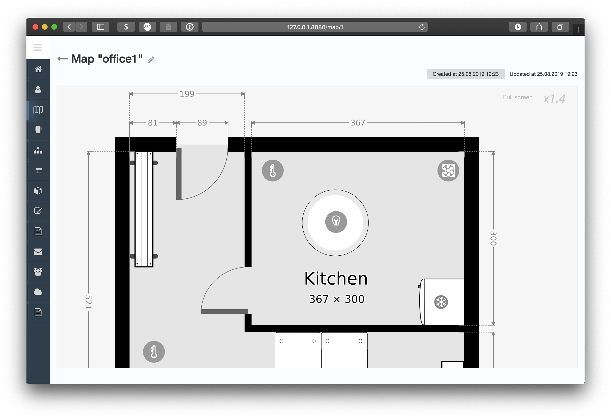
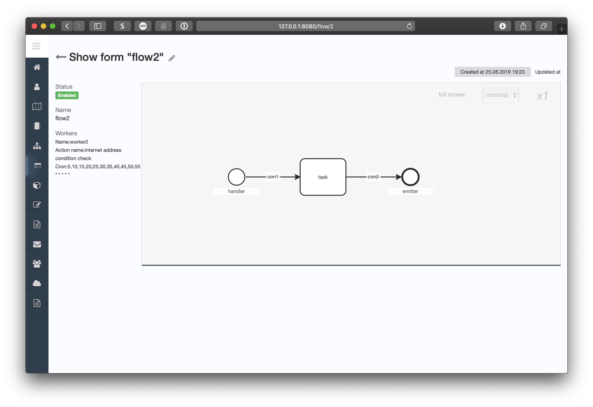

Smart home configurator
-----------------------

[Project site](https://e154.github.io/smart-home/) |
[Server](https://github.com/e154/smart-home/) |
[Mobile gate](https://e154.github.io/smart-home-gate/) |
[Node](https://github.com/e154/smart-home-node/) |
[Smart home Socket](https://github.com/e154/smart-home-socket/) |
[Modbus device controller](https://github.com/e154/smart-home-modbus-ctrl-v1/) |
[Mobile app](https://github.com/e154/smart-home-app/)

[](https://travis-ci.org/e154/smart-home-configurator)

[](https://opensource.org/licenses/MIT)

Attention! The project is under active development.
---------

| screenshots | screenshots |
|:-------------------------:|:-------------------------:|
|  |  |
|  |  |

### Installation for development

```bash
go get -u github.com/golang/dep/cmd/dep

git clone https://github.com/e154/smart-home-configurator $GOPATH/src/github.com/e154/smart-home-configurator

cd $GOPATH/src/github.com/e154/smart-home-configurator

dep ensure

go build
```

editing configuration files

```bash
cp conf/config.dev.json conf/config.json

```

init project files

```bash
./bin/project.sh --init
```

run frontend development tools

```bash
./cd static_source && gulp
```

run server

```bash
./smart-home-configurator
```

It's all

### LICENSE

[MIT Public License](https://github.com/e154/smart-home-configurator/blob/master/LICENSE)