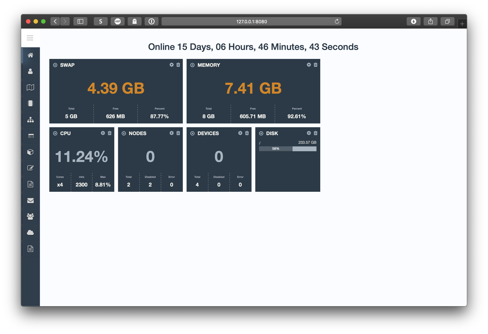

Smart home configurator
-----------------------

[Project site](https://e154.github.io/smart-home/) |
[Server](https://github.com/e154/smart-home/) |
[Mobile gate](https://github.com/e154/smart-home-gate/) |
[Node](https://github.com/e154/smart-home-node/) |
[Smart home Socket](https://github.com/e154/smart-home-socket/) |
[Modbus device controller](https://github.com/e154/smart-home-modbus-ctrl-v1/) |
[Mobile app](https://github.com/e154/smart-home-app/)


[](https://www.gnu.org/licenses/gpl-3.0)

|Branch      |Status   |
|------------|---------|
|master      | [](https://travis-ci.org/e154/smart-home-dashboard?branch=master)   |
|dev         | [](https://travis-ci.org/e154/smart-home-dashboard?branch=develop) |


Attention! The project is under active development.
---------

| screenshots | screenshots |
|:-------------------------:|:-------------------------:|
|  |  |
|  |  |

### Installation for development

```bash
git clone https://github.com/e154/smart-home-dashboard $GOPATH/src/github.com/e154/smart-home-dashboard

cd $GOPATH/src/github.com/e154/smart-home-dashboard

go mod vendor

go build
```

editing configuration files

```bash
cp conf/config.dev.json conf/config.json

```

init project files

```bash
./bin/project.sh --init
```

run frontend development tools

```bash
./cd static_source && gulp
```

run server

```bash
./smart-home-dashboard
```

new module

```bash
ng g m config --route config --module=app
```

new component

```bash
ng g c auth/base --module=auth
```

new service

```bash
ng g service @core/services/window
```

### install depends on MAC OS

```bash
brew search node
brew install node@8
brew link node@8
```

now add string at ~/.bash_profile

```bash
echo 'export PATH="/usr/local/opt/node@8/bin:$PATH"' >> ~/.bash_profile
```

install gulp and bower

```bash
node -v
#v8.16.1

npm -v
#6.4.1

./cd static_source && npm install

node install gulp -g
node install bower -g
```

It's all

### LICENSE

[GPLv3 Public License](https://github.com/e154/smart-home-dashboard/blob/master/LICENSE)
